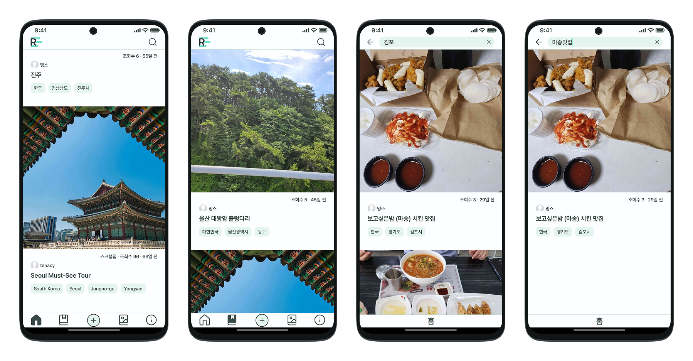
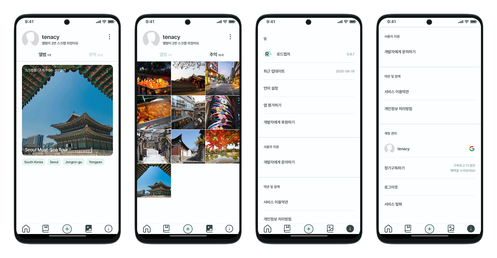
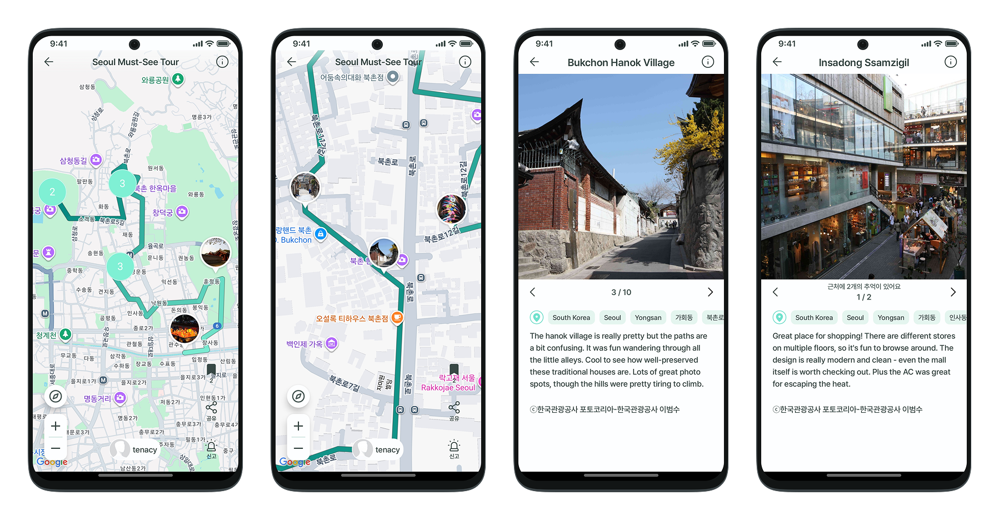
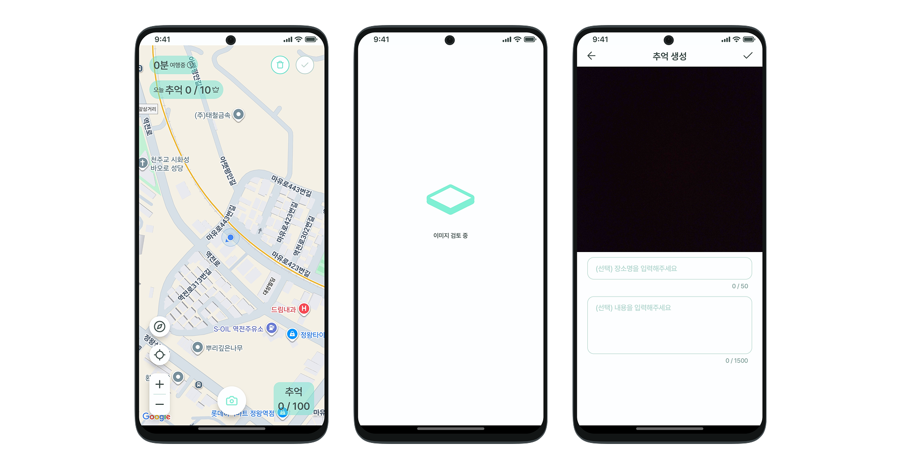

## Overview

로드캡처는 이동 경로를 정밀하게 추적하고 사진과 위치 정보를 결합하여 여행의 순간을 시각화하는 안드로이드 애플리케이션입니다.

단순한 위치 기록을 넘어, GPS 신호가 불안정한 환경에서의 데이터 무결성 확보와 배터리 효율성을 고려한 백그라운드 트래킹 시스템을 구축하는 데 중점을 두었습니다. 또한, 사용자 경험을 저해하지 않으면서 부적절한 콘텐츠를 필터링하기 위해 서버 리소스 대신 모바일 기기 내에서 동작하는 경량화된 딥러닝 모델(On-device AI)을 도입했습니다.

현대적인 Android 개발 방법론인 MVVM 아키텍처와 Jetpack 컴포넌트를 기반으로 구축되었으며, 오프라인 우선 설계를 통해 네트워크 연결이 불안정한 여행지 환경에서도 안정적인 서비스를 제공합니다.

<a href='https://play.google.com/store/apps/details?id=com.tenacy.roadcapture'>
  
</a>

## App Preview

주요 기능별 실행 화면입니다. 아래 항목을 클릭하여 상세 화면을 확인하세요.

<details>
<summary><strong>Home / Scrap / Search</strong></summary>
<br>

</details>

<details>
<summary><strong>My Album / App Info</strong></summary>
<br>

</details>

<details>
<summary><strong>Album View (Map & Slider)</strong></summary>
<br>

</details>

<details>
<summary><strong>Create Album</strong></summary>
<br>

</details>

## Key Features

* **Intelligent Route Tracking**: 가속도 및 자이로스코프 센서를 융합한 알고리즘을 통해 사용자의 이동 상태(도보, 차량, 정지 등)를 감지하고, 이에 따라 위치 수집 주기를 동적으로 조절하여 배터리 효율과 경로 정확도를 동시에 확보합니다.
* **Context-Aware Geotagging**: 촬영된 사진의 메타데이터와 추적된 경로 데이터를 매칭하여 위치 정보를 자동으로 태깅하고, 역지오코딩을 통해 좌표를 유의미한 장소명으로 변환합니다.
* **On-Device Content Moderation**: ONNX Runtime을 활용하여 기기 내부에서 실시간으로 이미지를 분석하고 NSFW(Not Safe For Work) 콘텐츠를 필터링합니다. 이는 사용자 프라이버시를 보호하고 서버 운영 비용을 절감합니다.
* **Seamless Cloud Sync**: Room Database를 활용한 로컬 캐싱과 Firebase Firestore를 통한 원격 동기화를 결합하여, 오프라인 상태에서도 데이터 유실 없는 사용성을 보장합니다.

## Technical Stack

### Android & Architecture
* **Language**: Kotlin (100%)
* **Architecture**: MVVM (Model-View-ViewModel), Repository Pattern
* **Asynchronous Processing**: Coroutines, Flow
* **Dependency Injection**: Dagger Hilt
* **Local Storage**: Room Database (SQLite)

### Location & Maps
* **Tracking**: Android Location Services (FusedLocationProvider), Foreground Service
* **Mapping**: Google Maps SDK for Android
* **Geocoding**: Nominatim API, LocationIQ

### Backend & Cloud (Serverless)
* **Database**: Firebase Firestore
* **Storage**: Firebase Storage
* **Compute**: Firebase Cloud Functions
* **Authentication**: Firebase Auth (OAuth 2.0 integration)

### Machine Learning
* **Inference Engine**: ONNX Runtime, TensorFlow Lite
* **Model Optimization**: Quantized MobileNet variations for edge devices

## Engineering Challenges & Solutions

### 1. 백그라운드 위치 추적의 안정성 확보
안드로이드의 배터리 최적화 정책(Doze mode 등)으로 인해 백그라운드에서 위치 서비스가 강제로 종료되거나 GPS 신호가 튀는 현상이 발생했습니다. 이를 해결하기 위해 포어그라운드 서비스로 격상하여 프로세스 우선순위를 확보하고, 칼만 필터와 센서 퓨전 알고리즘을 적용하여 GPS 노이즈를 제거하고 경로의 연속성을 보장했습니다.

### 2. 온디바이스 AI를 통한 리소스 최적화
사용자가 업로드하는 모든 이미지를 서버에서 검열하는 것은 막대한 비용과 개인정보 전송 문제를 야기합니다. 이에 PyTorch 기반의 NSFW 탐지 모델을 모바일 환경에 맞게 경량화하고 ONNX 포맷으로 변환하여 앱에 내장했습니다. 이를 통해 네트워크 통신 없이 평균 100ms 이내의 추론 속도로 유해 이미지를 차단하는 시스템을 구축했습니다.

### 3. 글로벌 타임존 대응 데이터 정합성 관리
전 세계 사용자의 '하루' 기준이 다르기 때문에, 일일 사용량 제한 초기화 시점에 대한 기술적 이슈가 있었습니다. 클라이언트의 시간 조작 가능성을 배제하기 위해, 사용자 가입 시 타임존 오프셋을 저장하고 서버(Firebase Functions)에서 UTC 기준으로 각 타임존의 자정을 계산하여 크론 작업을 수행하는 중앙 집중식 스케줄링 시스템을 구현했습니다.

## Installation

이 프로젝트는 Android Studio Flamingo 이상 버전을 권장합니다. 앱의 실제 구동 화면은 [구글 플레이 스토어](https://play.google.com/store/apps/details?id=com.tenacy.roadcapture)에서도 확인하실 수 있습니다.

1. 저장소를 복제합니다.
    ```bash
    git clone https://github.com/tenoenc/roadcapture.git
    ```

2. 외부 의존성 및 환경 변수를 설정합니다.
   * **Full Setup**: 모든 기능을 사용하려면 [외부 의존성 설정 가이드](docs/set-dependencies.md)를 참고하여 API Key를 설정해주세요.
   * **Minimal Setup**: API Key 없이 UI 및 로컬 기능을 빠르게 확인하고 싶다면, 가이드의 [Minimal Configuration](docs/set-dependencies.md#option-2-minimal-configuration) 섹션을 참고하세요.
3. 프로젝트를 빌드하고 실행합니다.
    ```bash
    ./gradlew installDebug
    ```


## License

이 프로젝트는 **CC BY-NC-SA 4.0** (Creative Commons Attribution-NonCommercial-ShareAlike 4.0 International) 라이선스 하에 배포됩니다.

다음 조건을 준수하는 한, 누구나 자유롭게 코드를 복제, 배포 및 수정할 수 있습니다.

* **저작자 표시 (Attribution):** 적절한 출처와 라이선스 링크를 표시하고, 변경 사항이 있는 경우 이를 명시해야 합니다.
* **비영리 (NonCommercial):** 이 프로젝트를 **상업적 목적(영리 추구)으로 절대 사용할 수 없습니다.**
* **동일조건 변경허락 (ShareAlike):** 이 프로젝트를 리믹스, 변형하거나 2차 저작물을 작성할 경우, 해당 결과물에도 원본과 **동일한 라이선스**를 적용해야 합니다.

자세한 내용은 [LICENSE](./LICENSE) 파일을 참고하시기 바랍니다.