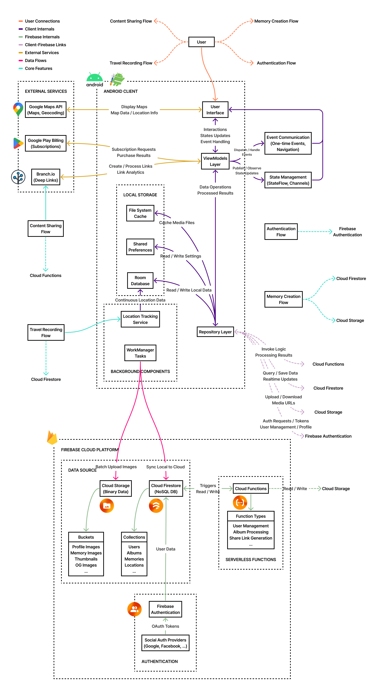

<a href='https://play.google.com/store/apps/details?id=com.tenacy.roadcapture'></a>

# 로드캡처

로드캡처는 여행 경로를 추적하고 특별한 순간을 기록하는 위치 기반 여행 기록 앱입니다. 실시간으로 여행 경로를 지도 위에 시각화하고, 촬영한 사진에 위치 정보를 자동으로 연결하여 소중한 추억을 장소와 함께 기록할 수 있습니다.

## 목차

1. [스크린샷](#스크린샷)
2. [주요 기능](#주요-기능)
3. [기술 스택](#기술-스택)
4. [시스템 아키텍처](#시스템-아키텍처)
5. [기술적 도전과 해결 방법](#기술적-도전과-해결-방법)
6. [설치 및 실행 방법](#설치-및-실행-방법)
7. [향후 개선 계획](#향후-개선-계획)
8. [라이선스](#라이선스)

## 스크린샷


## 주요 기능

### 여행 경로 추적
- 실시간 경로 기록: 여행 시작부터 종료까지 사용자의 이동 경로를 실시간으로 추적하고 지도에 표시합니다.
- 백그라운드 추적: 앱이 백그라운드에 있거나 화면이 꺼져 있어도 지속적으로 위치 데이터를 수집합니다.
- 오프라인 지원: 인터넷 연결 없이도 경로 추적이 가능하며, 앨범 생성 시 데이터가 동기화됩니다.

### 추억 생성 및 관리
- 위치 기반 사진 촬영: 현재 위치 정보가 자동으로 사진에 태그되어 나중에 어디서 찍은 사진인지 쉽게 확인할 수 있습니다.
- 장소 자동 인식: 역지오코딩을 통해 위치 좌표를 실제 장소 이름으로 변환하여 표시합니다.
- 사진 편집 기능: 앱 내에서 사진 크롭 및 기본적인 편집이 가능합니다.
- 장소 및 메모 추가: 추억에 사용자 정의 장소 및 메모를 추가할 수 있습니다.
- NSFW 콘텐츠 검열: 경량화된 로컬 딥러닝 모델을 사용하여 이미지를 필터링합니다. 이는 다른 사용자에게 부적절한 콘텐츠를 노출시키는 것을 방지합니다.

### 앨범 관리
- 앨범 생성: 여행 경로와 사진들을 하나의 앨범으로 묶어 관리할 수 있습니다.
- 공개/비공개 설정: 앨범의 공개 여부를 설정하여 프라이버시를 조절할 수 있습니다.
- 공유 링크 생성: 앨범을 외부 플랫폼에서 확인할 수 있도록 URL을 생성합니다.
- 지도 기반 탐색: 앨범 내 사진들을 지도에서 위치 기반으로 확인할 수 있습니다.
- 슬라이더 기반 탐색: 앨범 내 사진들을 슬라이더를 통해 보다 자세한 내용과 함께 확인할 수 있습니다.  

### 소셜 기능
- 여행 공유: 자신의 여행 경로와 사진을 앱 내 혹은 앱 외에 있는 다른 사용자들이게 공유할 수 있습니다.
- 콘텐츠 탐색: 다른 사용자들이 공유한 여행 기록을 탐색하고 영감을 얻을 수 있습니다.
- 스크랩 기능: 마음에 드는 다른 사용자의 여행 기록을 저장하여 나중에 참고할 수 있습니다.
- 검색 기능: 장소, 태그, 사용자 등 다양한 기준으로 콘텐츠를 검색할 수 있습니다.

### 사용자 경험
- 소셜 로그인: 구글, 카카오, 네이버, 페이스북 계정으로 간편하게 로그인할 수 있습니다.
- 다국어 지원: 한국어를 포함한 총 12개 언어를 지원하여 전 세계 사용자들이 이용할 수 있습니다.
- 딥링크 지원: 공유된 링크를 통해 앱의 특정 콘텐츠로 바로 이동할 수 있습니다.
- 구독 시스템: 프리미엄 기능 이용을 위한 구독 옵션을 제공합니다.

### 사용량 제한
- 광고 시스템: 리워드형, 네이티브형 광고를 통해 무료 플랜 사용자를 수익 모델에 기여시킵니다.
- 크레딧 초기화: 사용자 지역의 시간대에 맞춰 매일 자정에 추억 생성 크레딧을 초기화합니다. 서버 중앙에서 일괄 관리함으로써 사용자가 임의로 초기화 동작을 우회하는 것을 방지합니다. 

## 기술 스택

로드캡처는 현대적인 안드로이드 개발 기술과 라이브러리를 활용하여 구축되었습니다.

### 프레임워크 및 언어
- Kotlin: 전체 코드베이스는 Kotlin으로 작성되었으며, 코루틴과 Flow를 적극 활용하여 비동기 작업을 처리합니다.
- Android Jetpack: 최신 안드로이드 개발 컴포넌트를 활용합니다.
    - Navigation Component: 앱 내 화면 전환 및 딥링크 처리
    - ViewModel & LiveData: UI 상태 관리 및 데이터 바인딩
    - Room: 로컬 데이터베이스 관리
    - WorkManager: 백그라운드 작업 스케줄링
- MVVM 아키텍처: Model-View-ViewModel 패턴을 적용하여 관심사를 분리하였습니다.
- Dagger Hilt: 의존성 주입을 통해 코드를 모듈화하였습니다.

### 위치 및 지도 서비스
- Google Maps SDK: 지도 표시, 경로 시각화, 마커 클러스터링 등에 활용합니다.
- FusedLocationProvider: 정확하고 효율적인 위치 데이터 수집을 위해 사용합니다.
- Foreground Service: 백그라운드에서도 지속적인 위치 추적을 위해 활용합니다.
- Nominatim & LocationIQ API: 역지오코딩(좌표→주소 변환) 서비스에 활용합니다.

### 데이터 관리
- Firebase Firestore: 클라우드 데이터베이스로 사용자 데이터, 앨범, 추억 등을 저장합니다.
- Firebase Storage: 사용자가 업로드한 이미지 및 서버 리소스를 저장합니다.
- Firebase Functions: 무결성을 보장해야 하는 데이터에 대해 처리할 함수를 제공합니다.
- Room Database: 오프라인 지원 및 캐싱을 위한 로컬 데이터베이스로 활용합니다.
- Algolia: 고성능 검색 기능 구현에 활용합니다.

### 인증 및 소셜 통합
- Firebase Authentication: 사용자 인증 기반으로 활용합니다.
- Firebase Functions: 사용자 인증이 필요한 작업에 대해 처리할 함수를 제공합니다.
- 소셜 로그인 SDK: Google, Kakao, Naver, Facebook 로그인을 지원합니다.
- Branch.io: 딥링크 및 공유 기능 구현에 활용합니다.
- Google Play Billing: 구독 및 인앱 결제 처리에 활용합니다.

### UI 및 미디어 처리
- Material Design 3: 현대적이고 사용자 친화적인 UI 디자인에 적용했습니다.
- Glide: 효율적인 이미지 로딩 및 캐싱에 활용합니다.
- uCrop: 이미지 크롭 기능 구현에 활용합니다.
- TensorFlow Lite: 부적절한 콘텐츠 필터링에 활용합니다.

## 시스템 아키텍처

로드캡처는 안드로이드 클라이언트와 Firebase Cloud Platform으로 구성된 모던 아키텍처를 채택하고 있습니다. 클라이언트는 MVVM 패턴을 기반으로 UI, 뷰모델, 레포지토리 계층으로 구성되어 있으며, Firebase 서비스와의 효율적인 통합을 통해 서버리스 아키텍처를 구현했습니다.

로드캡처는 다음과 같은 요소로 구성되어 있습니다.

1. 안드로이드 클라이언트: MVVM 아키텍처를 기반으로 UI, 뷰모델, 레포지토리 계층으로 구성되어 있으며, Room 데이터베이스를 통한 로컬 캐싱과 백그라운드 위치 추적 서비스를 통해 사용자 경험을 최적화합니다.
2. Firebase Cloud Platform: 인증, 데이터 저장소, 서버리스 함수를 포함한 클라우드 서비스로, 사용자 관리, 데이터 저장 및 백엔드 로직을 처리합니다.
3. 외부 서비스 통합: Google Maps API, Google Play Billing, Branch.io와 같은 외부 서비스를 통합하여 지도 표시, 구독 관리, 딥 링크 기능을 제공합니다. 이 외에도 Algolia, Google Admob와 같은 외부 서비스를 사용하여 고급 검색, 광고 시스템 등의 기능을 제공합니다.  
4. 주요 데이터 플로우: 인증, 여행 기록, 메모리 생성, 콘텐츠 공유 등의 핵심 기능에 대한 데이터 흐름을 효율적으로 관리하여 앱의 주요 사용자 경험을 구현합니다.
5. 상태 및 이벤트 관리: LiveData, StateFlow, 코틀린 Channel을 활용한 UI 상태 관리 시스템으로, 안정적인 사용자 경험과 메모리 효율성을 보장합니다.



## 기술적 도전과 해결 방법

로드캡처는 다음과 같은 기술적 과제를 해결했습니다.

### 1. 포어그라운드 / 워커 분리로 데이터 무결성과 사용자 경험 개선

도전 과제: 중요 데이터 트랜잭션의 무결성을 보장하면서도 앱 응답성을 유지해야 함

해결 방법:
- 앨범 생성 등 중요 데이터 생성은 사용자가 진행 상황을 확인할 수 있도록 포어그라운드 처리
- 데이터 소실 위험이 높은 대용량 트랜잭션의 ACID 요구사항 충족
- 앨범 삭제, 상태 변경 등 재시도 가능한 작업은 WorkManager로 백그라운드 처리
- 작업 특성에 따른 처리 방식 최적화로 UX와 데이터 안정성 균형 확보

결과: 앱 응답 시간 개선과 동시에 중요 데이터 트랜잭션의 100% 무결성 보장

### 2. 캐시 시스템 구현으로 데이터 로딩 속도 최적화 및 네트워크 사용량 절감

도전 과제: 대용량 앨범 데이터 로딩 시 네트워크 부하와 사용자 대기 시간 발생

해결 방법:
- 앨범 데이터의 불변성 특성을 활용한 로컬 DB 캐싱 시스템 구현
- 메모리 및 위치 데이터를 Room 데이터베이스에 저장하여 재방문 시 즉시 로딩
- 동적으로 변경 가능한 유저 정보는 별도 로직으로 실시간 조회 처리
- WorkManager를 활용한 주기적 캐시 정리 작업 자동화로 저장 공간 최적화

결과: 앨범 상세 페이지 초기 로딩 시간 단축 및 오프라인 접근성 향상으로 사용자 경험 개선

### 3. 일일 API 사용량 제한을 위한 서버 기반 타임존별 크레딧 리셋 시스템 구축

도전 과제: 다국적 사용자의 타임존별 자정 시점에 크레딧을 정확히 초기화하면서도 사용자의 크레딧 조작 시도 방지 필요

해결 방법:
- 사용자 가입 시 타임존 정보 수집 및 DB에 타임존 오프셋 저장
- Firebase Functions를 활용한 15분 주기 크론 작업 구현
- UTC 기준 전 세계 타임존 자정 시점 계산 알고리즘 개발
- 지연 대응 및 오류 복구를 위한 중복 처리 메커니즘 구현
- 배치 처리 및 재시도 로직으로 대규모 사용자 데이터 안정적 처리

결과: 클라이언트 조작에 영향받지 않는 안전한 크레딧 시스템으로 사용자별 일일 API 사용량 효과적 제한

### 4. 온디바이스 NSFW 필터링 구현으로 콘텐츠 안전성 확보

도전 과제: 사용자 생성 콘텐츠 공유 앱에서 부적절한 이미지 업로드 사전 차단 필요

해결 방법:
- 여러 NSFW 감지 모델 비교 분석으로 Freepik의 nsfw_image_detector 선정
- PyTorch 모델을 ONNX 형식으로 변환하고 양자화를 통한 최적화 구현
- 안드로이드 디바이스에서 동작 가능하도록 모델 사이즈 및 메모리 사용량 최소화
- ONNX Runtime 통합 및 입력/출력 포맷 변환 로직 구현
- 다단계 이미지 처리 파이프라인 구축 (압축 → NSFW 감지 → 결과 판정)
  - NSFW 심각도 지표: neutral / low / medium / high
  - 판정 기준: 4단계 분류 중 0.5 이상의 누적 확률로 medium 이상 카테고리 감지 시 부적절 콘텐츠로 차단

결과: 서버 의존 없이 디바이스에서 직접 부적절 콘텐츠 필터링으로 사용자 경험 유지 및 플랫폼 안전성 확보

### 5. 다계정 제한 및 신뢰성 있는 구독 관리 시스템 구현

도전 과제: 소셜 로그인 환경에서 구글 플레이 구독의 다계정 혜택 공유 방지 및 정확한 구독 상태 유지

해결 방법:
- 계정별 고유 구독 상태 관리를 통한 혜택 중복 적용 차단
- Firebase Functions를 통한 Google Play Developer API 연동 구현
- 서버 기반 구독 유효성 검증으로 클라이언트 조작 방지
- WorkManager를 활용한 주기적 구독 상태 확인 및 자동 갱신 관리
- 안전한 구독 상태 유지를 위한 24시간 유예 기간 설정 및 취소 이벤트 감지

결과: 구독 정보의 신뢰성 확보와 다계정 혜택 중복 방지로 비즈니스 모델 보호 및 수익 안정화

### 6. 지도 기반 사진 경로 표시 및 마커 클러스터링 구현

도전 과제: 위치 기반 사진들의 시간적 순서와 공간적 군집을 모두 고려한 효과적인 탐색 경험 제공 필요

해결 방법:
- 구글 맵 SDK 통합 및 촬영 경로 실시간 폴리라인 렌더링 구현
- 위치별 커스텀 이미지 마커 및 자동 클러스터링 메커니즘 개발
- 동일 위치에 시간대별 여러 사진이 있을 경우 시각적 구분을 위한 클러스터 처리
- 클러스터 마커 클릭 시 사용자 선택 옵션 제공
    - 범위 뷰: 클러스터 내 특정 위치의 사진들만 그룹화하여 슬라이드 보기
    - 전체 뷰: 전체 여행 경로의 시간순 흐름대로 슬라이드 보기
- 동적 줌 레벨에 따른 경로 최적화 및 마커 렌더링 효율화

결과: 사용자가 시간적 흐름과 공간적 관계를 모두 고려하여 자유롭게 여행 기록을 탐색할 수 있는 직관적 인터페이스 제공

<details>
<summary>기술적 도전 및 한계</summary>

### GPS 점프 현상 감지 및 최적화된 경로 추적 시스템 구현

도전 과제: 지하철, 터널 등 GPS 신호가 불안정한 환경에서 경로 추적 정확도 유지 및 오류 방지

해결 방법:
* 다차원 칼만 필터 구현으로 위치 데이터 노이즈 제거 및 부드러운 경로 생성
* 가속도, 자이로스코프 센서 융합을 통한 이동 상태 감지 및 위치 업데이트 최적화
* GPS 점프 감지 알고리즘 개발: 급격한 방향 전환, 비정상적 가속도, 정확도 변화 모니터링
* 이동 수단별(도보, 자전거, 자동차, 기차) 적응형 위치 처리 파라미터 자동 조정
* 지하 모드 자동 감지 및 저정확도 환경에서 경로 보존 로직 구현

결과 및 한계점: GPS 점프 현상은 효과적으로 제거했으나, 안드로이드 배터리 최적화 정책으로 인한 백그라운드 제약으로 장시간 사용 시 불연속적인 경로가 생성되는 한계 발생
</details>

## 설치 및 실행 방법

### 개발 환경 설정

### 1. 필수 요구사항
- Android Studio Flamingo 이상
- JDK 17 이상
- Kotlin 1.9.24
- Gradle 8.7

### 2. 프로젝트 클론 및 기본 설정

```bash
git clone https://github.com/tentenacy/roadcapture.git
cd roadcapture
```

### 3. 외부 의존성 설정

이 내용은 [외부 의존성 설정](docs/set-dependencies.md) 문서를 참고해주세요.

### 빌드 및 실행

#### 1. 그래들 빌드 실행

```bash
./gradlew clean build
```

#### 2. 앱 설치 및 실행

```bash
./gradlew installDebug
```

또는 Android Studio에서 빌드와 실행이 가능합니다.
- Android Studio에서 프로젝트 열기
- 기기 또는 에뮬레이터 선택
- Run 버튼 클릭

## 향후 개선 계획

- 안드로이드 배터리 최적화 정책의 제약을 극복하여 장시간 사용 시에도 연속적인 경로 추적을 보장하는 최적화된 위치 추적 시스템 개발
- 주요 기술적 도전 주제에 대해 상세 문서화

## 라이선스

이 프로젝트는 비상업적 오픈소스 라이센스(NCOL v1.0) 하에 배포됩니다.

자세한 내용은 [LICENSE](./LICENSE) 파일을 확인해주세요.